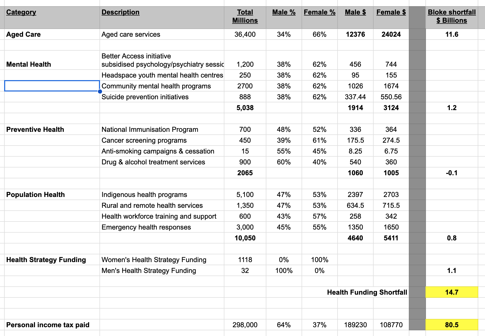

+++
title = "Men's Health"
description = "A Hugo theme for creating Reveal.js presentations"
outputs = ["Reveal"]

[reveal_hugo]
history = true
slide_number = true
transition = "slide"
transition_speed = "fast"
custom_theme = "custom-theme.scss"
custom_theme_compile = true
controls = true
controlsTutorial = true
controlsLayout = "bottom-right"
controlsBackArrows = "visible"

+++

# Hello Dan!

&nbsp;
&nbsp;
&nbsp;
&nbsp;

---

### Assumption #1

# Men = Women

- {}different brains{}
- {}seeking help{}
- {}talking about problems{}
- {}vulnerability & sensitivity = weakness{}

---

### Assumption #2

# Men have mates

- {}43% of Aussie Men have experienced loneliness{}
- {}16% report high levels of loneliness{}
- {}1/3 men believe there's no one to help them out{}
- {}increasibly more isolated society...{}

---

## Assumption #3

# GPs = Mental Health
&nbsp; 
&nbsp; 
&nbsp; 

---

## Assumption #4

# Call Lifeline

- {}50% of suicides never call  &nbsp; &nbsp; &nbsp;{}

---

## Assumption #5

# Organisations

- {}Movember{}
- {}Men's Shed{}
- {}Lifeline{}

---

# Australia  is not  doing enough !!  😳 🤬 ☠️

---

<section>

# Unfair Funding

- {}Women's Health Strategy: $1118 million{}
- {}Men's Health Strategy: $32{}
- {}35x{}
- {}WTF !!{}

---

</section>

---
## Basement Slide 1
This appears below the main slide

---

# Bad Outcomes

 - {}Male suicides: 2,800{}
 - {}Early Male Deaths: 35,000{}
- {}Alcohol, Drugs, Gambling, Domestic Violence{}

---

<!-- | Tax: Men   | 63.5% |
| ----- | ----- |
| Women | 36.5% | -->

## Outcomes

 - {}Male suicides: 2,419 (2023)  {}
 - {}Early Male Deaths: {}
 

---

---

<!-- 
Men process emotions differently 
Brain Waring 

 -->

---

# The End

&nbsp;
&nbsp;
&nbsp;
&nbsp;

<!-- 

---

# Men's Mental Health

- {}Thriving / Prospering {}
- {}Doing Fine {}
- {}Struggling {}
- {}Surviving {}

---

# Unhappy Men

### Visible Signs

- {}Drinking {}
- {}Drugs {}
- {}Dangerous behaviour {}
- {}Aggression {}

---

# Unhappy Men

### Invisible Signs

- {}Depression {}
- {}Loneliness {}
- {}Isolation {}
- {}Hopelessness {}

---

## Outcomes

 - {}Underperformance{}
 - {}Suffering{}
 - {}Early Death{}
 - {}Suicide{}

---

 -->